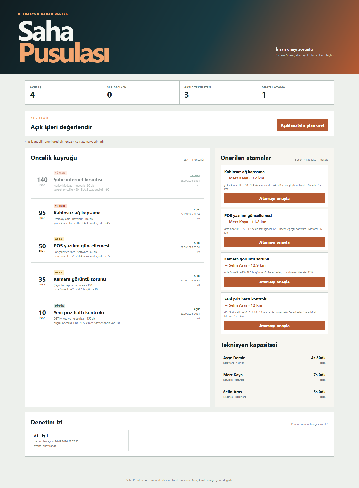

# Saha Pusulası

Saha servis işlerini SLA, önem, teknisyen becerisi, vardiya kapasitesi ve yaklaşık mesafeyle sıralayan; öneriyi otomatik karar yerine insan onayına bırakan operasyon demonstrasyonu.



## Neden bu proje?

Saha ekibinde “en yakın kişiyi gönder” yaklaşımı kritik işi geciktirebilir; yalnız SLA'ya bakmak da gerekli beceriyi ve kapasiteyi gözden kaçırabilir. Saha Pusulası her önerinin puanını ve gerekçesini gösterir. Kullanıcı onaylamadan atama yapılmaz; onay sürüm kontrolüyle doğrulanır ve denetim izine yazılır.

## Teknik özellikler

- FastAPI ve SQLite ile kalıcı iş, teknisyen, beceri ve denetim izi modeli
- SLA penceresini ve iş önemini açıklayan deterministik puan
- Haversine mesafesi, beceri filtresi ve vardiya kapasitesiyle kararlı öneri
- İnsan onaylı atama; `expected_version` ile iyimser eşzamanlılık kontrolü
- Her atamada önce/sonra durumu, aktör ve zamanı kaydeden audit olayı
- Güvenlik başlıkları, `no-store` API yanıtları, veri tabanı kısıtları
- Birim ve API entegrasyon testleri, kapsam eşiği, CI ve ayrıcalıksız Docker imajı

## Çalıştırma

```bash
python -m venv .venv
.venv\Scripts\activate
python -m pip install -e ".[dev]"
uvicorn sahapusulasi.api:app --reload
```

Arayüz `http://127.0.0.1:8000`, API belgesi `/docs` adresindedir.

## Karar sınırı

Öneri bir rota optimizasyonu veya otomatik iş emri değildir. Trafik, yol ağı, mola, vardiya saatleri, sertifika süresi ve gerçek konum akışı modellenmez. Koordinatlar yalnız kuş uçuşu mesafe içindir. Üretimde kimlik doğrulama, rol yetkisi, şifreleme, veri saklama politikası ve kurumsal harita servisi gerekir.

## AI kullanımı

Üretken yapay zekâyı alternatif puanlama modelleri, tehdit senaryoları, test sınırları ve dokümantasyon incelemesi için kullandım. Nihai puan politikası, insan onayı, veri modeli ve doğrulama bana aittir. Çalışma zamanında yapay zekâ modeli yoktur. Ayrıntı: [AI_USAGE.md](AI_USAGE.md).

## Lisans

[MIT](LICENSE)
